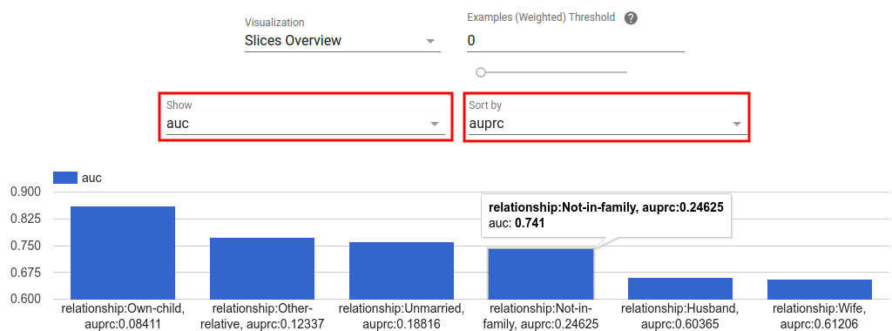
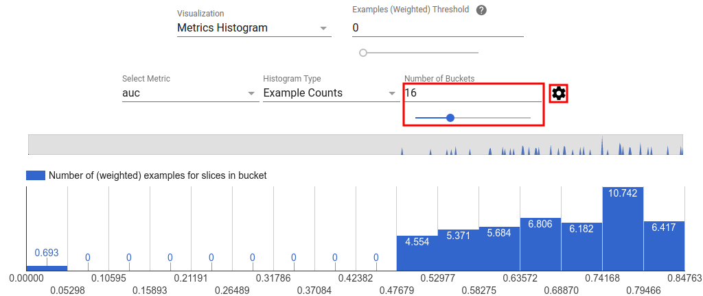
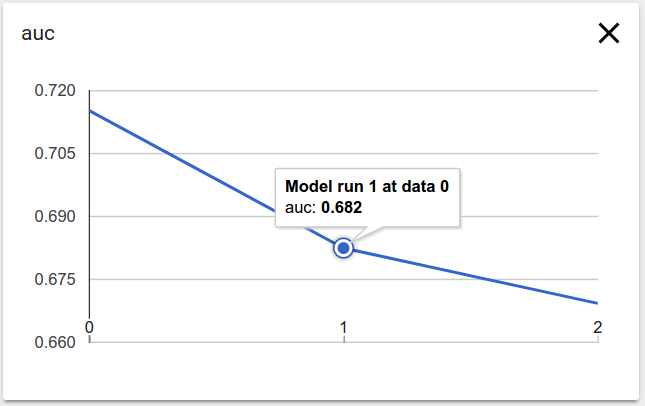

# TensorFlow Model Analysis Visualizations

The output of running an evaluation is a
[`tfma.EvalResult`](../api_docs/python/tfma/#tensorflow_model_analysis.EvalResult)
which can be visualized in a Jupyter notebook by calling
[`tfma.view.render_slicing_metrics`](../api_docs/python/tfma-view#tensorflow_model_analysis.view.render_slicing_metrics)
(or
[`tfma.view.render_plot`](../api_docs/python/tfma-view#tensorflow_model_analysis.view.render_plot)
for plots).

### Metrics View

To view metrics, use the
[`tfma.view.render_slicing_metrics`](../api_docs/python/tfma-view/#tensorflow_model_analysis.view.render_slicing_metrics)
API passing the `tfma.EvalResult` that was output from the evaluation run. The
metrics view is composed of three parts:

*   Metrics Selector

    By default, all computed metrics are displayed and the columns are sorted
    alphabetically. Metrics selector allows the user to add / remove / reorder
    metrics. Simply check / uncheck metrics from the dropdown (hold Ctrl for
    multi-select) or type / re-arrange them directly in the input box.

    

*   Metric Visualization

    Metric visualization aims to provide intuition about slices in the feature
    chosen. A quick filtering is available to filter out slices with small
    weighted sample count.

    

    Two type of visualizations are supported:

    1.  Slice overview

        In this view, value for the chosen metric is rendered for each slice and
        the slices can be sorted by the slice name or the value of another
        metric.

        

        When the number of slices are small, this is the default view.

    2.  Metrics Histogram

        In this view, slices are broken down into buckets based on their metric
        values. The value(s) displayed in each bucket can be the number of
        slices in the bucket or the total weighted sample count for all slices
        in the bucket or both.

        

        The number of buckets can be changed and logarithmic scale can be
        applied in the settings menu by clicking on the gear icon.

        

        It is also possible to filter out outliers in the histogram view. Simply
        drag the desired range in the histogram as shown in the screenshot
        below.

        

        When the number of slices are large, this is the default view.

*   Metrics Table

    The metric table summarizes results for all metrics chosen in metrics
    selector. It can be sorted by clicking on the metric name. Only slices not
    filtered out will be rendered.

### Plot Views

Each plot has it own visualization that is unique to the plot. For more
information, see the relevant API documentation for the plot class. Note that
in TFMA, plots and metrics are both defined under [`tfma.metrics.*`](../api_docs/python/tfma-metrics)
By convention the classes related to plots end in `Plot`. To view plots, use the
[`tfma.view.render_plot`](../api_docs/python/tfma-view/#tensorflow_model_analysis.view.render_plot)
API passing the `tfma.EvalResult` that was output from the evaluation run.

### Time Series Graphs

Time series graphs make it easy to spot trends of a specific metric over data
spans or model runs. To create a time series graph, perform multiple evaluations
(saving the output to different directories), and then load them into a
`tfma.EvalResults` object by calling
[`tfma.load_eval_results`](../api_docs/python/tfma/#tensorflow_model_analysis.load_eval_results).
The results can then be displayed using
[`tfma.view.render_time_series`](../api_docs/python/tfma-view#tensorflow_model_analysis.view.render_time_series)

To display the graph for a specific metric, simply click on it from the dropdown
list. To dismiss a graph, click on the X on the upper right corner.

Hover over any data point in the graph shows a tooltip indicating model run,
data span, and metric value.
